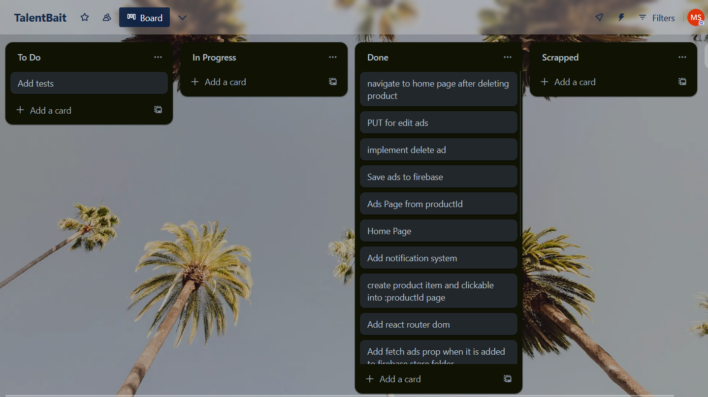

# Sports Goods Shop

## Set Up

Create an `.env` file in the base of the project and fill the following fields to access Firebase db:

```
VITE_API_KEY=
VITE_AUTH_DOMAIN=
VITE_PROJECT_ID=
VITE_STORAGE_BUCKET=
VITE_MESSAGE_SENDER_ID=
VITE_APP_ID=
```

Then simply run `npm i` and `npm run dev` on your machine.

## Description

You want to run ads on Facebook to get people's awareness for your online store for sports equipment. Create an internal tool that helps you create and manage your sport good ads for Facebook.

You should be able to create multiple posts for a specific product.

This CRUD tool should enable you to:

1. list all your Facebook ads
2. create new ones
3. edit ads
4. delete existing ones

Structure of Ad:

- Product Id: `string`
- Array of Pictures: `Array<string>`
- Description: `string`
- Headline: `string`
- CTA: `string`

## Requirements

**Index View**: List products and include all information. Product is clickable and opens **Read**.

**Read View**: Show ads for selected product and make it look like provided mock. You can create a new ad or editing existing one.

**Create View**: Create a new ad for a given product. Enable uploading images, adding a description, and change main headline.

**Update View**: Edit the existing ads.

**Delete View**: Modal prompt that asks for confirmation before deleting an ad. Show notifications on success.

**Navigation View**: Navbar with react-router

## Early Thoughts

1. Multiple ads can exist for 1 product. Just not complete duplicates I assume.
2. There are a lot of things to take note of so I created a Trello board to keep track of work.
3. The products are outlined in the json. Every product gets displayed from this ONE JSON file. I am not dealing with the CRUD part for products.
4. React Context is needed for going between create, read, and update views?
5. I could create an ad and store it in a postgresql database but I don't have much time. I will use Firestore for the moment?
6. If no ads exist for a product on the Read page, then show a simple text message.

## Changes

1. I added a productId to the shop_data array items.
2. I used Vite instead of Create React App as it's deprecated / not encouraged by React.
3. I wanted to use react-query for fetching from firebase.
4. I have added framer-motion and react-transition-group for simple animations.

## Post Challenge

1. I would like to make it more responsive for mobile views.
2. I would spend more time with testing.
3. I would use Typescript and SCSS / Tailwind for better styling methods.
4. Trello was an important part of keeping my direction in check.


